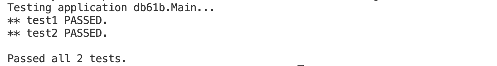
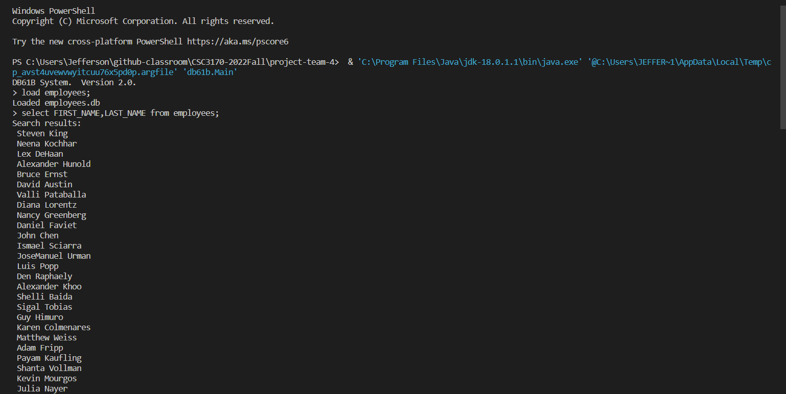
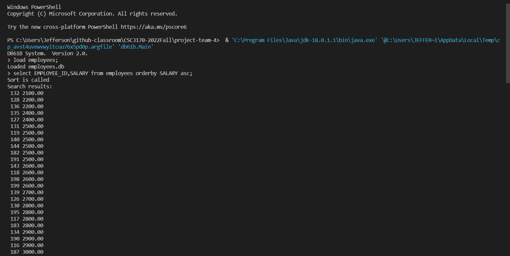
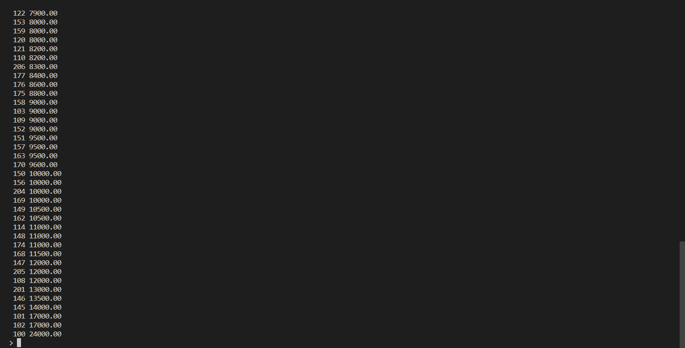
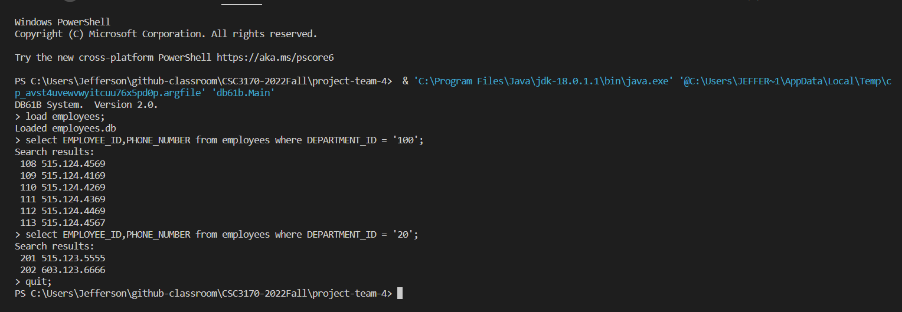
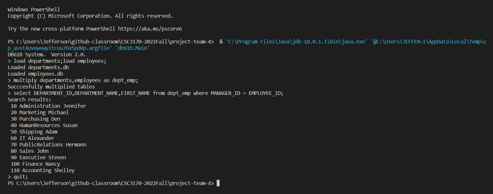
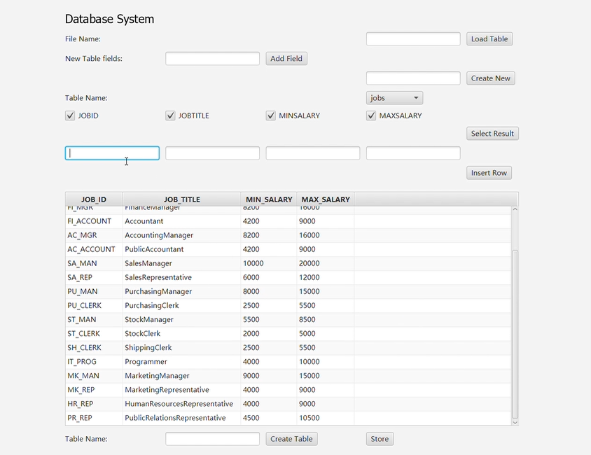

[](https://classroom.github.com/online_ide?assignment_repo_id=9431822&assignment_repo_type=AssignmentRepo)
# CSC3170 Course Project

## Project Overall Description

This is our implementation for the course project of CSC3170, 2022 Fall, CUHK(SZ). For details of the project, you can refer to [project-description.md](project-description.md). In this project, we will utilize what we learned in the lectures and tutorials in the course, and implement either one of the following major jobs:

<!-- Please fill in "x" to replace the blank space between "[]" to tick the todo item; it's ticked on the first one by default. -->

- [ ] **Application with Database System(s)**
- [x] **Implementation of a Database System**

## Team Members

Our team consists of the following members, listed in the table below (the team leader is shown in the first row, and is marked with 🚩 behind his/her name):

<!-- change the info below to be the real case -->

| Student ID | Student Name | GitHub Account (in Email) | GitHub Username |
| ---------- | ------------ | ------------------------- | ------------------------- |
| 119010256  | 邵佳琪 🚩    |119010256@link.cuhk.edu.cn  |     [luuvy757](https://github.com/luuvy757)             |
| 119010022  | 陈诺涵       |flyn_lin@163.com           |      [flyn-linda](https://github.com/flyn-linda)            |
| 119010434  | 张启航       | 2447086160@qq.com        |  [Zhang-Setsail](https://github.com/Zhang-Setsail)                |
| 120040023  | Jefferson    |jeffersonjtedjojuwono@gmail.com | [jeffersonjt](https://github.com/jeffersonjt)               |
| 119010297  | 王景仪       | 119010297@link.cuhk.edu.cn | [pastyy](https://github.com/pastyy)           |
| 119010442  | 张天琦       | 1157956961@qq.com |  [tqZzzz](https://github.com/ZhangTianqi-Yuki)              |


## Project Specification

<!-- You should remove the terms/sentence that is not necessary considering your option/branch/difficulty choice -->

After thorough discussion, our team made the choice and the specification information is listed below:

- Our option choice is: **Option 3**

## Abstract
For this project we will create a simple Database Management System in Java. The basic structure of our database system is to store tables, each table having their own rows of data and predetermined columns. The basic functionalities of our database system would be to create a table, load a table from a file, store data into a table, insert a new row into a table, print a table, to select certain data from specific tables. 

We will use the skeleton file provided by UCB, and would have 5 classes we need to complete, which are the CommandIntrepeter, Database, Table, Row, and Condition. Other classes such as the tokenizer class which is used to read the inpupt for the database has already been given in the skeleton file provided by UCB. Our main strategy is to work our way up, starting from the most specific classes before finally integrating them all in the CommandIntrepeter class. Our order would be to implement most functions for the classes row, table, database, commandintrepter, and finally work on the condition class for complex select funtionality. Generally we will follow the suggested order given in the pdf file from UCB. While working on the classes and functionality of the database we would also write test cases for easier debugging and to ensure the program is working as intended.

Once the simple database is completed and fully functional, we would redo assignment 2 using our simple database instead of SQL. (Excluding some queries that requires more complex functionalities not avaiable in our simple database system)


# Program Design 
<!-- Give explanation for the repository structure (may use an independent paragraph in the profile and/or in each sub-directories, or describe it in some section like Program Design)
Provide brief and explicit explanation and hyper link for any important and descriptive file (e.g. your TODO list).**** -->
## Directory Structure
The skeleton code provided by UCB is in the `inst.eecs.berkeley.edu
` folder, the **DIRECTORY STRUCTURE** and **TODO LIST** is described in the [Project](https://github.com/CSC3170-2022Fall/project-team-4/tree/main/inst.eecs.berkeley.edu). 
- `db61b` is the directory that our team works on. It contains all the files that we use to implement the database managemnet system. 
- `testing` is the directory that includes testing files for the database system.
## Design Overview
The data management system is designed with mainly following steps. 
- First, command interpreter will read the input from the user and tokenize it. The intruction format of the DBMS refers to the [project website](https://inst.eecs.berkeley.edu/~cs61b/fa14/hw/proj1.pdf).
    - `CommandInterpreter.java`: reading the input from the user and calling the corresponding functions in the database class. 
    The basic commands including: `load`, `store`, `create`, `insert`, `print`, `select`, `help`, `exit`. 

- Then, the command interpreter will call the database to execute the command, and the database will call the corresponding functions in the table class. 
    - `Database.java`: represents a database, which is a collection of tables.
    - `Table.java`: calling the corresponding functions in the row class. 
    - `Row.java`: storing the data in the row.
    - `Condition.java`:  represents a condition that can be used to filter rows from a table.
    - `Column.java`: storing the data in the column.

In the next section, we will present functions' implementation in details.

# Functionality Implementation

***Work Flow***

The main work flow of the command line version:
-> `Class`:`CommandInterpreter` parse the command line 
-> Call function from other `Class` with Input in command 
-> Gather the return to `Class`:`CommandInterpreter` and output in command line.


**Database**: The "Database" initializr a HashMap object to store the tables. The `keys` in the HashMap are the *names* of the tables and the `values` are the *Table objects*.
- `get` returns the *Table object* stored in the database with given `name`. 
- `put` adds the given `table` to the database with given `name`.

**Load Table**  
Test Example `load students;`
`Table.readTable (name)` reads a table file `students.db` with the given filename and returns a  `Table` object. Then, the database uses `put` to add the table to the database with the given name.

**Print Table**     
Test Example: `print students;`

The `Database.get(name)` first retrieves the table specified by the name given in the input. Then `Table.print()` iterates through the rows in the table and prints each element in the row on a separate line.

**Select**  
Test Example: `select SID, Firstname from students
     where Lastname = 'Chan';`

The `CommandInterpreter.selectClause()` firstly parse and execute a `SELECT` statement in a database. It takes in a token stream and returns a Table object for query result. This method can be appiled to one or two tables (joint selection).

**Insert**  
Test Example: `insert into enrolled values '102', '22100', 'B+';`

The `CommandInterpreter.insertStatement()` firstly parse and generate a Row data from the Insert command. Then it will try to insert this Row into the table using ` Table.add()`. The program will get the return from ` Table.add()` and output whether program successfully insert the value.

**Creat Table**  
 `<create statement> ::= create table <table name> <table definition> ;`
Test Example: `create table enrolled2 as
  select SID
     from enrolled, schedule 
     where Dept = 'EECS' and Num = '61A';`

The `CommandInterpreter.createStatement()` firstly parse and generate a Table container from the Create command using `CommandInterpreter.tableDefinition()`. Then it will try to parse the command and make sure the data stored in the table. After that, the database will put the table inside with `Database.put()`.

**Store Database**      

The `CommandInterpreter.storeStatement()` will call the function `Table.writeTable(name)`. This function work like the `Table.print()` and the difference is that `Table.writeTable(name)` will output the stream to a file.


## Extra Works

### **Additional Command Support for Assignment 2**
(Details for assignment 2 can be found in [as2_description](as2-description.md))

For the demonstration of the implementation of our database system, we will use the previous assignment 2 that we have done on SQL and try to run those queries here on our database system instead. We have made the required databases and chosen a few queries to test on our database system. We have yet to implement all 15 queries from assignment 2, because our database has limitations in implementing all the complex functionalities.

To implement the queries we added some additional functionalities to our database systems which are:
- order by
- inner join (natural join)
- table multiplication

For the demonstration we will run 4 queries from assignment 2 on our database system.
- QUERY 2  : Show the first_name and last_name of all employees
- QUERY 3  : Write a query to show the employee_id and the salary of all employees in ascending order of salary
- QUERY 7  : Write a query that selects employee_id, and phone_number of those employees who are indepartments 20 or 100
- QUERY 16 : Write a query to get the department_id, department_name, and manager's first_name for departments


### **GUI Implementation ([brach `with_gui`](https://github.com/CSC3170-2022Fall/project-team-4/tree/with_gui))**
Javafx was used to implement the GUI. It is in another branch, with_gui. The main implementation is in `src/main/java/com/example/gui_dbms/OperationWindow.java` and the entrance of the program is `HelloApplication.java` under the same path. `DatabaseCaller.java` is the class that actually calls the functionalities of the implemented database system. 

The functionalities that the GUI covers includes: 
- loading tables from .db files
- creating a table by inputting field names
- creating tables by selecting column(s) from an existing table 
- inserting a row into an existing table
- export a table as a .db file. 

A different IDE, Intellij idea, was used to implement the GUI. Since the implementer of this part did not figure out how to fix the dependency problems when using VSCODE to run it, the followings are how to run it with intellij idea:

Open the project (branch with_gui) with intellij idea. 

If it shows any problems with junit or javafx when you try building it, go to File > Project Structure, click on the `+`, copy the path of the library and save. For example, under `src\main\java\dbms\lib` there is `junit.jar`. For Javafx, if you use Windows, you can download the lib here, https://download2.gluonhq.com/openjfx/19/openjfx-19_windows-x64_bin-sdk.zip
If you still cannot solve the dependency problem you can google it or contact 119010297. 

Run `HelloApplication.java` and you should see a window appear. 

# Testing Results 
**DBMS test** 
```bash
$ cd inst.eecs.berkeley.edu
$ make check  # run all tests
```


**Queries of Assignment2**

- QUERY 2  : Show the first_name and last_name of all employees
   
- QUERY 3 : Show the employee_id and the salary of all employees in ascending order of salary
   
    

- QUERY 7: Select employee_id, and phone_number of those employees who are indepartments 20 or 100
   

- QUERY 16: Get the department_id, department_name, and manager's first_name for departments
   


**GUI**



<!-- # Difficulty Encountered & Solutions (Optional) -->


# Conclusion
In conclusion, we constructed a simple Database Management System in Java and verified its functionalities through test cases. In order to make increase the application scene of our DBMS, we add some extra functionalities to deal with the huge data in Assignment 2. Moreover, we designed a front-end webpage for the database with the GUI connecting the backend to further improve the user experience.

# Contribution:
|Student ID | Name | Contribution|
| ---------- | ------------ | ------------------------- | 
|119010256  | 邵佳琪 | Finish part of the UCB code & report |
| 119010022  | 陈诺涵       | Finish part of the presentation|
| 119010434  | 张启航       | Finish part of the UCB code & report|
| 120040023  | Jefferson    | Implementation of A2, part of the presentation & part of the report|
| 119010297  | 王景仪       | Implementation of GUI & part of the report|
| 119010442  | 张天琦       | Finish part of the UCB code & report|


# Presentation
- Slides [pptx](https://cuhko365-my.sharepoint.com/:p:/g/personal/119010022_link_cuhk_edu_cn/EWfT93WzJE1Ls0dUnPgqaugBlO333vkUnvgZx0VBo2YEmg?e=7yB20c)[pdf](https://cuhko365-my.sharepoint.com/:b:/g/personal/119010022_link_cuhk_edu_cn/EflA7QqjAZFDplYqlvpYTgsBSlPItcAnzVx0OHLYgIN9Sw?e=BtAHJA)
- Video [mp4](https://cuhko365-my.sharepoint.com/:v:/g/personal/119010022_link_cuhk_edu_cn/EXa2ps8-KkNDkZKRj1hg3ZwBqsfhW-JIVqaBrwSW2rvBzw?e=Ru00sP)

